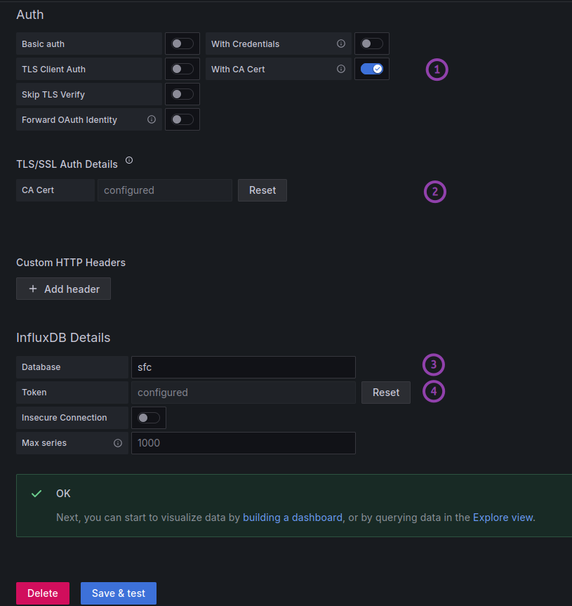
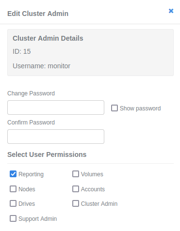
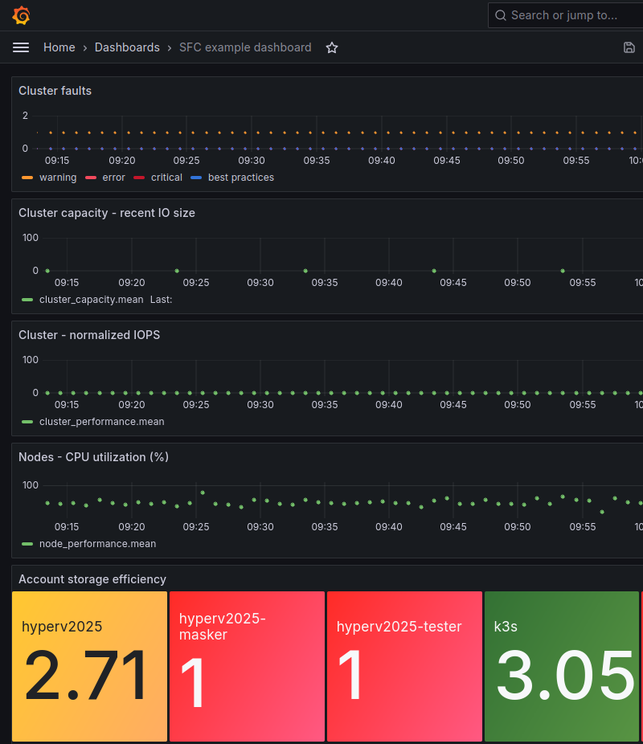

# SFC - SolidFire Collector (formerly SolidFire-related component in HCI Collector)

- [SFC - SolidFire Collector (formerly SolidFire-related component in HCI Collector)](#sfc---solidfire-collector-formerly-solidfire-related-component-in-hci-collector)
  - [Architecture](#architecture)
    - [Requirements](#requirements)
  - [Quick start](#quick-start)
    - [SFC in containers](#sfc-in-containers)
    - [`utils` container](#utils-container)
  - [`sfc.py`](#sfcpy)
    - [Security notes](#security-notes)
  - [CA and TLS configuration](#ca-and-tls-configuration)
    - [CAs](#cas)
    - [TLS certificates for OS and containers](#tls-certificates-for-os-and-containers)
      - [OS](#os)
      - [Containers](#containers)
    - [How to upload your TLS certificate to SolidFire](#how-to-upload-your-tls-certificate-to-solidfire)
    - [Grafana with TLS access to InfluxDB 3 Core](#grafana-with-tls-access-to-influxdb-3-core)
  - [SolidFire cluster administrator account with only read \& reporting access](#solidfire-cluster-administrator-account-with-only-read--reporting-access)
  - [InfluxDB requirements and data retention](#influxdb-requirements-and-data-retention)
  - [About SFC stack](#about-sfc-stack)
  - [Screenshots and demos](#screenshots-and-demos)
  - [Metrics](#metrics)
  - [Dependencies](#dependencies)
  - [About project and repository name change (HCI Collector to SFC)](#about-project-and-repository-name-change-hci-collector-to-sfc)
  - [Alternatives to SFC](#alternatives-to-sfc)
  - [History of SFC](#history-of-sfc)
  - [License and Trademarks](#license-and-trademarks)

SFC is a metrics and (limited) configuration collection script for SolidFire storage systems running Element OS v12.5 or newer minor releases.

## Architecture


You may use existing InfluxDB 3 instance or deploy new one based on standard Docker Compose or Kubernetes templates for InfluxDB 3. SFC uses InfluxDB v3 with default configuration.

Grafana has to be user-provided and dashboards created once InfluxDB is added as Grafana data source. See [dashboards](./docs/dashboards.md) for help with that.

### Requirements

- Environment
  - SolidFire 12 (NetApp HCI, NetApp eSDS)
  - Recent Python 3 (see `sfc/requirements.txt` for 2 main dependencies) on host or a container platform
  - CPU and RAM requirements: SFC is expected to use around 1-2% CPU and 70MB RAM (guesstimate for hard limits: 5% CPU, 100 MB RAM).
  - Disk requirements for SFC are just the container itself. If InfluxDB tiers to S3, a small SolidFire cluster might create around 25 MB of new data per day on S3 bucket (without down-sampling)
  - Applications to store and visualize data
    - Recent InfluxDB 3 Core and admin (aka "operator") API token (SFC creates a database itself if database DB does not exist, otherwise - if admin creates a database for you - you may use a "user" token with lesser permissions)
    - Recent Grafana (12.2) - SFC v2 has no direct or indirect dependency on Grafana, but 12.1 and earlier have bugs related to InfluxDB 3 Core

- SolidFire-specific details
  - **Unique** volume names - this is not enforced by the SolidFire API since it is volume IDs that are unique by default. Most people don't use duplicate volume names because it's confusing, but if you happen to have duplicate volume names, don't use SFC because it won't work well
  - Volume names must **not be be integers** - volume name should have at last one letter at the beginning (this is a fallback method to distinguish volume name from ID). The new "hard" requirements was introduced because neither volume IDs nor duplicate alphanumeric names make sense in dashboards that visualize more than a handful of volumes, which means almost 100% of users.
  - SFC no longer attempts to "solve" the problem of invalid **TLS certificates**. If you want to use SFC v2, please deploy valid certificates to your SolidFire and InfluxDB or import your certificate chain to the OS or container SFC is running on. Or you can change the SF source code and Influx configuration to get around the requirement for valid TLS certificates.

SFC only ever `read`s and `list`s SolidFire API objects and doesn't attempt to connect to the Internet.

## Quick start

**NOTE:** InfluxDB 3 defaults to port 8181 regardless of whether it's accessible over HTTP or HTTPS. `sfc.py` uses **`https://`** to connect to InfluxDB.

Create a read-only (Reporting permissions) cluster admin account on SolidFire (see in [Security](#security) if you don't know how).

If using existing InfluxDB, ask the admin for access to a new `sfc` database. By default InfluxDB 3.3 allows creation of new databases to admin token bearers and SFC automatically creates one if it does not exist, so you don't have to do anything in InfluxDB if you deploy your own using default container settings for InfluxDB 3 - just make sure InfluxDB is running with a valid TLS certificate, reachable by SFC and that the InfluxDB API token is good. If InflxuDB is set to not allow database creation or the API token isn't allowed, then SFC will err as database won't be created and sending metrics to a non-existing database can't work.

Then download, install and run SFC:

```sh
# release v2.0.0 uses InfluxDB 1
git clone -b v2.1.0 https://github.com/scaleoutsean/sfc/
cd sfc/sfc
python3 -m venv .venv
source .venv/bin/activate
python3 -m pip install -r requirements.txt
# With InfluxDB 3 at https://192.168.1.146:8181, valid TLS certs on SF and InfluxDB,
#   InfluxDB database 'sfc' will be automatically created by SFC if InfluxDB Admin Token is valid 
#   and Influx database 'sfc' does not exist. HTTPS is assumed.
python3 ./sfc.py --mvip 192.168.1.30 -u monitor -p ******* -ih s146.datafabric.lan -it $API_TOKEN -ip 8181 -id sfc
```

Try `--log-level DEBUG` if you get stuck or describe your problem in Discussions here.

**Non-containerized** (easier) installation: install SFC's dependencies with Python pip (see `sfc/requirements.txt`), make sure the TLS certificates on SolidFire and InfluxDB are acceptable to host where Python runs (use curl or something to check) and run `sfc.py -h`.

**Containerized** (harder): set variables (MVIP, USERNAME, etc.) in YAML or .env var and deploy. **If your SolidFire does not or InfluxDB do not have a valid TLS certificate**, you will need to copy these (and the CA/IA certificate) into the container to be visible to Python. Refer to generic Python-in-Docker instructions.

See [dashboards.md](./docs/dashboards.md) about visualization, metrics and measurements (aka "tables").

### SFC in containers

The main difference when running in Docker Compose is we read InfluxDB API token from file (set in environment variables) whereas when running the CLI we can use `-it` to provide token.

Feel free to modify or build your own with `sfc.py` in it.

Copy `.env.example` to `.env` and modify it for your needs before running `docker compose build`.

Pre-built containers **will not work** if your SolidFire and InfluxDB don't have valid public TLS certificates or don't load them when they run. In such cases this below cannot work unless you build the containers yourself and include at least your CA into container image.

```sh
docker run --name=sfc docker.io/scaleoutsean/sfc:v2.1.0 --mvip 192.168.1.30 -u monitor -p ********** -ih 192.168.1.146 -ip 8181 -it ${YOUR-INFLUXDB-API-TOKEN} -id sfc
```

### `utils` container

It isn't required, so it doesn't have to be started and may even be removed to lower attack surface.

Its purpose is for convenient administration and troubleshooting of InfluxDB 3. We may use it from inside or outside. Example:

```sh
$ docker-compose exec utils bash -c 'TOKEN=$(cat /influxdb_tokens/sfc.token) && /home/influx/.influxdb/influxdb3 query -H https://influxdb:8181 --token $TOKEN --database sfc "SHOW TABLES" | head -10'
+---------------+--------------------+-------------------------------------+------------+
| table_catalog | table_schema       | table_name                          | table_type |
+---------------+--------------------+-------------------------------------+------------+
| public        | iox                | account_efficiency                  | BASE TABLE |
| public        | iox                | accounts                            | BASE TABLE |
| public        | iox                | cluster_capacity                    | BASE TABLE |
| public        | iox                | cluster_faults                      | BASE TABLE |
| public        | iox                | cluster_performance                 | BASE TABLE |
| public        | iox                | cluster_version                     | BASE TABLE |
| public        | iox                | drive_stats                         | BASE TABLE |
```

## `sfc.py`

After we descend to the `sfc` directory, create a Python venv and install modules from `sfc/requirements.txt`:

```sh
$ ./sfc/sfc.py -h
usage: sfc.py [-h] [-m [MVIP]] [-u USERNAME] [-p PASSWORD] [-ih [INFLUXDB_HOST]] [-ip [INFLUXDB_PORT]] [-id [INFLUXDB_NAME]] [-it [INFLUXDB_TOKEN]] [-fh [HI]] [-fm [MED]] [-fl [LO]] [-ex] [-ll [{DEBUG,INFO,WARNING,ERROR,CRITICAL}]] [-lf [LOGFILE]]
              [-c CA_CHAIN] [-v]

Collects SolidFire metrics and sends them to InfluxDB.

options:
  -h, --help            show this help message and exit
  -m [MVIP], --mvip [MVIP]
                        MVIP or FQDN of SolidFire cluster from which metrics should be collected.
  -u USERNAME, --username USERNAME
                        username for SolidFire array. Default: SF_USERNAME
  -p PASSWORD, --password PASSWORD
                        password for admin account on SolidFire cluster. Default: SF_PASSWORD or, if empty, prompt to provide it.
  -ih [INFLUXDB_HOST], --influxdb-host [INFLUXDB_HOST]
                        host IP or name of InfluxDB. Default: 192.168.1.169
  -ip [INFLUXDB_PORT], --influxdb-port [INFLUXDB_PORT]
                        HTTPS port of InfluxDB. Default: 8181
  -id [INFLUXDB_NAME], --influxdb-name [INFLUXDB_NAME]
                        name of InfluxDB database to use. SFC creates it if it does not exist. Default: sfc
  -it [INFLUXDB_TOKEN], --influxdb-token [INFLUXDB_TOKEN]
                        InfluxDB 3 API authentication token. Default: INFLUXDB3_AUTH_TOKEN environment variable or hardcoded value.
  -fh [HI], --frequency-high [HI]
                        high-frequency collection interval in seconds. Default: 60
  -fm [MED], --frequency-med [MED]
                        medium-frequency collection interval in seconds. Default: 600
  -fl [LO], --frequency-low [LO]
                        low-frequency collection interval in seconds. Default: 3600
  -ex, --experimental   use this switch to enable collection of experimental metrics such as volume QoS histograms (interval: 600s, fixed). Default: (disabled, with switch absent)
  -ll [{DEBUG,INFO,WARNING,ERROR,CRITICAL}], --loglevel [{DEBUG,INFO,WARNING,ERROR,CRITICAL}]
                        log level for console output. Default: INFO
  -lf [LOGFILE], --logfile [LOGFILE]
                        log file name. SFC logs only to console by default. Default: None
  -c CA_CHAIN, --ca-chain CA_CHAIN
                        Optional CA certificate file(s) to be copied to the Ubuntu/Debian/Alpine OS certificate store. For multiple files, separate with commas (e.g., "ca1.crt,ca2.crt"). Can be set via CA_CHAIN environment variable. Users of other systems
                        may import manually. Default: None
  -v, --version         Show program version and exit.

Author: @scaleoutSean https://github.com/scaleoutsean/sfc License: the Apache License 2.0

```

You can also try this, which should load `SF_USERNAME` and `SF_PASSWORD` from environment variables or prompt you to provide them:

```sh
./sfc.py --mvip 192.168.1.30 -ih 192.168.1.146 -it API_TOKEN -ip 8181 -id sfc
```

If you want something different, try `-h` or hard-code argument values into script for a test run and try with just `python3 ./sfc/sfc.py` (and nothing else).

### Security notes

- SolidFire TLS certificate
  - As mentioned above, SFC won't assist users in circumventing HTTPS security. SFC may or may not reject invalid TLS certificates, but when it does that would not be considered a bug or issue for SFC to solve. If your SolidFire MVIP uses FQDN and has has a valid TLS certificate, at the very least you can run SFC out of a VM - just import SolidFire TLS certificates to OS trust store so that Python can find them and that's it. Users of containerized SFC may need to prepare their SolidFire's certificate chain *or* certificate fingerprint of a self-signed SolidFire TLS (including those that use an IP address)
  - PowerShell script that uploads/refreshes TLS certificate can be found [here](https://github.com/scaleoutsean/awesome-solidfire/blob/master/scripts/updateTlsCertificate.ps1)
- SolidFire account used by SFC
  - If you want decent account security in SFC, use a dedicated SolidFire admin account with a Reporting-only (Read-only) role. Even the Reporting-only role has access to sensitive information (initiator and target passwords of your storage accounts are, well, read when account properties are queried, for example), but at least it cannot make modifications to SolidFire data (it only can `Get` and `List` API objects) so it can't change passwords to lock you out, or delete something. As a reminder, the sensitive information that read-only admin accounts can read if the password leaks is storage accounts' CHAP secrets, so you still need to guard it carefully
  - Where "sensitive" API methods are used (ListAccounts, for example), SFC removes CHAP credentials from the API response even though they are not used in any way (e.g. they are not sent to metrics database), but that lowers the risk of those secrets ending up in memory/kernel dump files
- SFC configuration file(s)
  - Docker Compose: SFC container configuration files may contain plain text passwords to the SolidFire API (also for the Web UI, since the username/password can be used for that purpose as well). You can consider using ENV variables, but you have to load them from somewhere, so that isn't much better. Still, if you do that, make sure they're not readable by others. If you have a vault service you can configure SFC container to get the password from vault service
  - Kubernetes and Nomad: SFC containers can use Kubernetes secrets or other source if you configure them
- SFC host/VM/container
  - Ensure that only administrator-level staff has access to your SFC host/VM/container namespace because of SFC account security and the possible .env file
  - Create a new user for SFC and limit access to .env and sfc.py to only that account. Better yet, use a vault service or Kubernetes secrets (not ideal, but probably better than plain text passwords in a VM)
  - Because SFC only needs to connect to SolidFire MVIP, host/VM/container can be connected only to SolidFire management network. sfc.py does not provide any external-facing service
- Network
  - SFC only connects to SolidFire to gather metrics which are then sent to InfluxDB. No other connections are required (of course, DNS for name resolution may be needed). SFC never attempts to connect to the Internet on its own.
- 3rd party containers and packages
  - InfluxDB version 3.0 only supported admin tokens. Multiple SFC instances can securely share one InfluxDB data base server if each SFC used a different database token, and they can also use the same InfluxDB database as every measurement is tagged with SolidFire cluster name. HTTP access to InfluxDB is possible, but SFC does not use that option
  - Optional S3 service for InfluxDB data tiering should also use HTTPS and proper TLS certificates as InfluxDB will reject invalid TLS on HTTPS S3 API endpoint. Among on-premises choices, the [Versity S3 Gateway](https://scaleoutsean.github.io/2023/06/14/versity-s3-posix-gateway.html) has been tested and found to work. MinIO should work as well.
  - Upstream containers (SFC base image, InfluxDB) are not audited or regularly checked for vulnerabilities by me. SFC doesn't run any external-facing service and InfluxDB is only accessed by Grafana. But feel free to inspect/update them on your own and use your own Influx and Grafana instances. SFC is built with fairly minimal dependencies, so that users can address vulnerabilities in 3rd party packages on their own
  - All SFC measurements are tagged with the SolidFire cluster name so multiple SFC instances can share the same InfluxDB database if shared access isn't a concern

## CA and TLS configuration

You can do this any way you want. This section is for those who need help.

### CAs

Make sure CA certificate(s) are in `./certs/_master/`. If you generate CA and server TLS certificates for Docker Compose, that will create `./certs/_master/ca.crt`. But you may still have another, such as `./certs/_master/corp_ca.crt`, for example, if CA that signed the TLS from SolidFire wasn't the same.

Some folks will have two, some may have even three (one for Docker Compose, one for SolidFire, another for S3 if you're tiering InfluxDB to some S3 object store which has a TLS certificate signed by a third CA).

SFC argument for multi-CA: `-c "../certs/_master/ca.crt,/home/sean/Documents/CAs/sf_ca.crt"`

This script can create all Docker-internal certificates for you: `./certs/_master/gen_ca_tls_certs.py`. Run it with `--service all` to generate a CA and all certificates in `./certs/`. CA details are under `./certs/_master/` and service certificates under their respective sub-directories of `./certs/`.

### TLS certificates for OS and containers

#### OS

This used to be "solved" by accepting whatever, but modern applications reject by default and sometimes don't have the option to accept invalid certificates.

Python (and by extension, SFC) needs to be able to validate SolidFire's TLS certificate and to do that it uses TLS from OS (or container) trust store.

This has nothing to do with SFC, so please figure it out for your OS (or container) and [this is a great place to start](https://stackoverflow.com/a/39358282). What follows is a quick summary for your convenience.

Python should reference OS CA locations so if you add certificates so that `openssl` works, Python (and SFC) may too. [(source)](https://stackoverflow.com/a/66258111).

I see this when connecting to SolidFire Demo VM which has a TLS issued by internal CA (i.e. "self-signed") using my development system. The OS has all (CA and SolidFire) certificates imported, so there's no problem when running SFC from the CLI. In the worst case you can take a Linux VM and run sfc.py in it without any special "engineering" efforts.

```sh
$ openssl s_client -connect 192.168.1.30:443 -showcerts < /dev/null
CONNECTED(00000003)
Can't use SSL_get_servername
depth=2 O = DataFabric, CN = DataFabric Root CA
verify return:1
depth=1 O = DataFabric, CN = DataFabric Intermediate CA
verify return:1
depth=0 CN = prod.datafabric.lan
verify return:1
---
Certificate chain
 0 s:CN = prod.datafabric.lan
   i:O = DataFabric, CN = DataFabric Intermediate CA
   a:PKEY: rsaEncryption, 2048 (bit); sigalg: ecdsa-with-SHA256
   v:NotBefore: May  3 15:50:40 2024 GMT; NotAfter: Aug  1 15:51:40 2024 GMT
   ...

```

#### Containers

There are two main traps here:

- Internally within Docker or a Kubernetes namespace, services use orchestrator-internal DNS names. If they're to be accessed externally, TLS must be valid for external FQDN if your service (such as InfluxDB) is supposed to be accessed from SFC running in another namespace
- If TLS certificate of the service you're connecting to isn't issued by a well-known CA you need to "load" the CA and IA certificates or embed them into the container

SFC lets you load your own CA certificates, which is why it's possible to load one for Docker-internal and another for SolidFire.

One of the ways to solve this without loading them is to copy your certificate chain(s) into the container when building it and run `update-ca-certificates` in the process.

Enterprise users should be able to get internal recipe and best practices for deploying containers with corporate CA chains - there's no need to reinvent the wheel and SFC doesn't invent or add any special requirements.

Other services also need to be aware of CAs used to create TLS they use. For example, our `utils` container should not require `--no-verify-ssl` when trying to query `influxdb` bucket on S3 object store:

```sh
aws --no-verify-ssl --endpoint-url https://s169:8443 --ca-bundle s3_certs/CA.crt s3 ls s3://influxdb
```

If you must use `--no-verify-ssl` despite loading `--ca-bundle`, you have a problem. `aws` with `--ca-bundle` ought to work. Your TLS may be issued to a wrong FQDN/hostname.

If, on the other hand, your InfluxDB and S3 run in Docker Compose or Kubernetes, then the endpoint URL for S3 might be something like `https://s3:9000` [or similar](https://min.io/docs/minio/kubernetes/upstream/operations/network-encryption.html#certificate-management-with-cert-manager) in Kubernetes (unfortunately there's a bunch of ways to do it, although MinIO has a Kubernetes Operator which makes at least one possible approach easy).

### How to upload your TLS certificate to SolidFire

See this post on [how to upload a TLS certificate to SolidFire using Postman](https://scaleoutsean.github.io/2020/11/24/scary-bs-postman-ssl-certs.html). The same can be done via the API or from SolidFire PowerShell Tools. It takes 5 minutes.

### Grafana with TLS access to InfluxDB 3 Core

Grafana 12.1 has a bug which prevents proper loading of custom CAs. That bug was fixed in 12.2.

- in (1), enable CA
- in (2), paste CA into Grafana UI
- in (3), specify your DB (default: `sfc`)
- in (4), paste your API token for named user (that admin created for you in InfluxDB 3 Core)



Within the same Docker Compose, you'd access InfluxDB 3 at `https://influxdb:8181`, use **SQL** (or InfluxQL, if you prefer) query language. Documentation for dashboards and example queries can be found in [DOCUMENTATION](./docs/dashboards.md).

## SolidFire cluster administrator account with only read & reporting access

You can do it from the SolidFire UI, PowerShell Tools, Postman, etc. JSON-RPC request for Postman and such:

```json
{
    "method": "AddClusterAdmin",
    "params": {
        "username": "monitor333",
        "password": "**********************************",
        "access": ["read", "reporting" ],      
        "acceptEula": true },
    "id": 1
}
```

This should result in a new admin account created on your SolidFire cluster.

Notes:

- The minimum password length is 8 characters, but you should use a complex password (24+).
- This account does not have to be local to SolidFire - LDAP/ADS is available as well, but I don't have these services so I haven't tried. Please check the documentation for more on that and mind password rotation rules in LDAP/ADS if you use this option



## InfluxDB requirements and data retention

InfluxDB 3 - starting with v3.2 - should be able to make retention configuration easy. Data tiering has been available since 3.0, so you have two options to economize:

- Data tiering (available since v3.0). Use any S3 bucket that works with InfluxDB 3
- Data retention and down-sampling (related features may become available in version 3.2 later this month)
- Plus some more related to caching (especially if you also tier to S3)

Other than that, SFC v2 aims to save resources. Usually SFC idles using 50MB RAM (resident memory size) and 1% of CPU. 

InfluxDB itself requires north of 1.5 GB RAM for data cache. Data gets quickly evacuated to S3, so local disk consumption is tiny and limited to cache. If you don't want to use S3, simply change InfluxDB object store configuration to `file`.

My single-node SolidFire cluster with close to 30 volumes is fairly representative of many 4-node SolidFire clusters used in NetApp HCI environments. Most have 4 SolidFire nodes (low frequency of collection and fewer metrics than my environment), but many have fewer "(VMware) data stores" i.e. volumes (high-frequency of collection and more metrics). 

With SFC 2.1.0 running 1,500 iterations (i.e. just over 24 hours) resulted in just 28 MB of data in the S3 bucket to which InfluxDB 3 was tiering. Not too bad!

```sh
$ du -sh s3_data/influxdb/s169/
28M	s3_data/influxdb/s169/
```

SFC v2.0 had 31 day retention, no tiering (InfluxDB 1), and no down-sampling implemented because InfluxDB v1 made that too much trouble (Grafana dashboards also had to be modified, etc.). If you have problems with disk capacity used by InfluxDB 1, you may want to consider SFC v2.1.0.

One important feature that InfluxDB 3 still doesn't have as of v3.3 is data down-sampling for aged data, which would keep data consumption in check and allow us to read less data when we visualize old metrics. SFC doesn't collect a lot of data because this was a problem with InfluxDB v1 as well and that's why since SFC 2.0.0 metrics are gathered on three schedules, but it'd be nice to have.

I have a [post](https://scaleoutsean.github.io/2025/01/24/influxdb-3-core-alpha.html) about InfluxDB from the time it was in alpha. Some things have changed since then, but I've uploaded the post twice, so it's reasonably accurate for version 3.1.

## About SFC stack

If you wonder what's what in `docker-compose.yaml`:

- `s3` - Versity S3 Gateway service is used by InfluxDB 3 Core as its back-end tier for almost all data. You can tier InfluxDB data to another place if you want. It is exposed on the host (HTTPS, port 8443) but protected from anonymous access
- `influxdb` - InfluxDB 3 Core, exposed on a secure port (HTTPS, 8181) and protected from anonymous access
- `sfc` - SolidFire Collector. Does not provide service on any port.
- `utils` - container with AWS and InfluxDB utilities if you need to troubleshoot any server. It pre-loads S3 and InfluxDB credentials so you may remove it if you don't want that around. Does not provide service on any port.
- `grafana` - just for testing, so it uses **HTTP** (port 3000) by default. Users are expected to use own Grafana and connect to InfluxDB on host using HTTPS

```sh
$ docker compose ps 
NAME             IMAGE                COMMAND                  SERVICE    CREATED         STATUS         PORTS
grafana          grafana:latest       "/run.sh"                grafana    3 hours ago     Up 3 seconds   0.0.0.0:3000->3000/tcp, :::3000->3000/tcp
influxdb3-core   influxdb:3-core      "/home/influx/influx…"   influxdb   4 seconds ago   Up 3 seconds   0.0.0.0:8181->8181/tcp, :::8181->8181/tcp
s3               versitys3gw:latest   "/entrypoint.sh"         s3         4 hours ago     Up 4 hours     0.0.0.0:8443->7070/tcp, [::]:8443->7070/tcp
sfc              sfc-sfc              "python /home/sfcuse…"   sfc        4 hours ago     Up 4 hours     
utils            sfc-utils            "/entrypoint.sh tail…"   utils      4 hours ago     Up 4 hours   
```

## Screenshots and demos



SFC v2 does not include ready-made Grafana dashboards but there's a sample dashboard with documented InfluxQL queries and main tables.

See [dashboards.md](./docs/dashboards.md) on how to get started. [dashboard.json](./docs/dashboard.json) contains dashboard code for this sample screenshot (it assumes the InfluxDB source in Grafana is named `sfc`).


## Metrics

HCI Collector suffered from excessive gathering of metrics in terms of both frequency and scope. That caused a variety of problems, perhaps not easy to notice, but still problems:

- Slow recovery after MVIP fail-over
- High load on the SolidFire API endpoint
- Fast metrics database growth

SFC attempts to put and end to that and should be able to handle clusters with 1000 volumes or even more.

- Frequent metrics gathering is limited: several metrics are gathered every 60 seconds. Examples:
  - Account properties - these don't change often, but when they do we wish to know
  - Cluster faults - these need to be updated often
  - Volume properties - needed for performance monitoring and storage management purposes
  - Volume performance - performance monitoring is one of top use cases
- Medium and low frequency data: metrics that do not need to be collected every 60 seconds are collected at much higher intervals
  - Everything else including experimental metrics 
  - **NOTE:** when you build dashboards from these measurements, set dashboard time interval to 60 minutes (or longer) and wait, as you may otherwise see "No data" in Grafana until 61 minutes have passed. Or create a two tiered dashboard system (see [dashboards.md](./docs/dashboards.md) for details)
- Because of different schedules and tasks, any stuck task (e.g. during MVIP failover) will fail on its own while others may fail or succeed on their own. Before (HCI Collector) a stuck task would stall all metrics gathering

## Dependencies

SFC v2 attempts to minimize the use of external modules. Even SolidFire's own SDK isn't used. My goal is to keep SFC simple, small, fast and secure.

Compared to previous version (HCI Collector v0.7), two top-level external libraries were removed and two added. Two main top-level dependencies are now APScheduler (for smarter scheduling) and aiohttp (the latter includes its own dependencies; you may view them with `pip list`, of course).

## About project and repository name change (HCI Collector to SFC)

Prior to NetApp's acquisition of SolidFire SolidFire Collector gathered only SolidFire metrics. After that the project was expanded wth 3rd party packages for vSphere monitoring and renamed to HCI Collector.

Starting with version 2.0.0 SFC returned to its original mission - completely rewritten and with big improvements over SFC from HCI Collector and earlier. [Here](#history-of-sfc) you may view more details about previous versions and contributors.

Latest NetApp HCI-focused version (HCI Collector v0.7.2) - can be found [here](https://github.com/scaleoutsean/sfc/tree/v0.7.2) for those who for some reason need it, but I wouldn't recommend it even to NetApp HCI users: for NetApp HCI I recommend using SFC v2 or one of the alternatives below and addressing vSphere (or KVM, Hyper-V, etc.) separately.

## Alternatives to SFC

- [SolidFire Exporter](https://github.com/mjavier2k/solidfire-exporter/) - Prometheus exporter
  - Exports "general" SolidFire metrics with (currently) a single schedule for all, potentially may not scale as well as SFC v2
  - [Getting started with SolidFire Exporter](https://scaleoutsean.github.io/2021/03/09/get-started-with-solidfire-exporter.html)
- SolidFire syslog forwarding to Elasticsearch or similar platform 
  - Detailed [steps](https://scaleoutsean.github.io/2021/10/18/solidfire-syslog-filebeat-logstash-elk-stack.html)
  - Requires more work to set up, but provides a path to both log and metrics collection
- NetApp Cloud Insights
  - As-a-service offering free up to 7 day retention and paid above that
  - Control plane in the cloud, basic metrics, no customization options

## History of SFC

I started contributing in 2019 and took over as the sole maintainer before v0.7.

- I took over before v0.7, released v0.7 and two security and compatibility updates. The main components used in HCI Collector during that time (up to HCI Collector v0.7.2) were as follows:
- [HCI Collector](https://github.com/jedimt/hcicollector/) from the period before I took over expanded scope 
  - [SolidFire SDK for Python](https://solidfire-sdk-python.readthedocs.io/)
  - [docker-graphite-statsd](https://github.com/graphite-project/docker-graphite-statsd) - Graphite and StatsD container by [Graphite](https://graphiteapp.org/). That documentation can be found [here](https://graphite.readthedocs.io/en/latest/releases.html)
  - [vsphere-graphite](https://github.com/cblomart/vsphere-graphite) - VMware vSphere collector for GraphiteDB
  - [Grafana](https://grafana.com)
- SolidFire Graphite Collector before NetApp's acquisition of SolidFire:
  - solidfire-graphite-collector.py - original SolidFire collector script by "cbiebers" (the Github account and repo were deleted at some point so I can't provide the URLs)

See [CHANGELOG.md](./CHANGELOG.md) for more details about the HCI Collector and SFC software changes.

I sometimes [blog about SolidFire](http://scaleoutsean.github.io) and maintain curated SolidFire resources such as [Awesome SolidFire](http://github.com/scaleoutsean/awesome-solidfire), where you can find pointers to various SolidFire content and simple Python and PowerShell scripts.

## License and Trademarks

- `sfc.py` and related configuration and deployment files and scripts are licensed under the Apache License, Version 2.0
- External, third party containers, scripts and applications may be licensed under their respective licenses
- NetApp, SolidFire, and the marks listed at www.netapp.com/TM are trademarks of NetApp, Inc. Other marks belong to their respective owners
