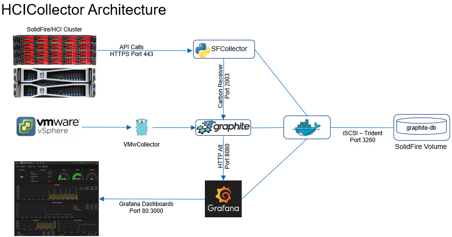

# SolidFire Collector (formerly HCI Collector)

HCI Collector is a container-based metrics collection and graphing solution for NetApp HCI and SolidFire systems running Element OS v11.0 or newer.

- HCI Collector >= v0.7 deployed based on this repo can monitor SolidFire and vSphere 6, 7 (i.e. NetApp HCI) 
- Stand-alone SolidFire Collector >= v0.7.1 can be deployed to Docker, Docker Compose, Kubernetes and Nomad. It gathers only (SolidFire) storage metrics

| If you install...   | it runs on                   | and gathers metrics for |
| :---                |  :---:                       | :---                |
| SolidFire Collector v1.0.5 | VM, Docker, Kubernetes,Nomad | SolidFire (NetApp HCI storage, NetApp eSDS)|
| HCI Collector v0.7.2| VM, Docker, Docker compose   | SolidFire, vSphere  |

Note: sfc is in `sfcollector-kubernetes/solidfire_graphite_collector.py`

## Alternatives

- [SolidFire Exporter](https://github.com/mjavier2k/solidfire-exporter/) - Prometheus exporter
  - [Getting started with SolidFire Exporter](https://scaleoutsean.github.io/2021/03/09/get-started-with-solidfire-exporter.html)
- SolidFire syslog forwarding to Elasticsearch or similar platform (detailed [steps](https://scaleoutsean.github.io/2021/10/18/solidfire-syslog-filebeat-logstash-elk-stack.html))

## Changes

See [CHANGELOG.md](CHANGELOG.md). Also:

- In this repo only SolidFire Collector will be refreshed and updated. VMware-related stuff will be removed in next release (if we get there)
- NetApp HCI users please use vmwcollector or other upstream project or tool to gather vSphere metrics

## FAQs

See the [FAQs](/docs/FAQ.md).

## Description

HCI Collector is a fully packaged metrics collection and graphing project for Element OS 11+ and vSphere 6+ clusters. It is based on the following components packaged as individual containers:

- sfcollector: container with SolidFire Python SDK and a metrics collecting script. Runs a Python script that collects SolidFire storage cluster data and feeds it to GraphiteDB via statsd
- vmwcollector: vSphere stats collector. Collects vSphere data and feeds it to GraphiteDB
- graphite: database that stores received time series data
- grafana and grafana-renderer: graphing engine and a renderer with a Web UI that visualizes Graphite data through SolidFire and vSphere dashboards

The HCI Collector uses internal VM disk space, but advanced users can use [NetApp Trident](https://docs.netapp.com/us-en/trident/index.html) or other storage to store Graphite DB on a NetApp block or file storage system.

### Architecture and Demos



- [HCI Collector walk-through for v0.7b](https://youtu.be/9vW-PozlIUk)
- [Demo of sfcollector using Element v11+ Volume Histograms](https://youtu.be/VHjgdtOr8Ws)

## Prerequisites and requirements

### SolidFire Collector (SFC)

See README file in folder sfcollector or use [this](https://hub.docker.com/repository/docker/scaleoutsean/sfc) container (or build your own).

You can build the container from sfcollector/Dockerfile.

### HCI Collector

HCI Collector was tested with the following configuration (newer components might work):

- Docker
- NetApp HCI (SolidFire, Element OS) v11.3 - v12.7
- VMware vSphere 6.7U3b or newer (other 6.x releases should work and so should vSphere 7 - see vsphere-graphite documentation)
- NetApp HCI storage and vCenter management accounts with read access to Element storage and vCenter API

Newer or older releases of each component may work. Element OS users with a pre-v11.0 software should check the FAQs.

HCI Collector has the following minimum requirements:

- A recent Linux VM with Docker CE 
  - Disk capacity: approximately 10GB for OS, 3MB/hour for GraphiteDB in a small environment (see the FAQs or Graphite docs on how to use less storage)
- Read-only access to management API of SolidFire/Element v11 (Management IP or "MVIP") and vCenter. HCI Collector can work with Element v10 and v11, but with v10 histogram metrics do not get collected and histogram panels won't work

## Installation and configuration

### SFC

- SFC takes less than one minute to deploy
- Docker: refer to [the Docker Hub page for SFC](https://hub.docker.com/repository/docker/scaleoutsean/sfc)
- Kubernetes: use the example Deployment file from `sfcollector` folder to deploy
- SFC takes less than one minute to deploy
- You may load Grafana dashboard files or build your own

### HCI Collector

- Read the Security section below and make a plan based on your security requirements
- Deploy a VM with a sufficiently large disk (say, 1,000 GB) or adjust GraphiteDB settings to retain less data by pruning it sooner
- Install Docker CE and docker-compose. Enable and restart Docker service
- Clone `sfc` repository (`git clone https://github.com/scaleoutsean/sfc`) or download the source code from Releases
- Execute the install script and provide requested inputs (`cd sfc; sudo ./install_hcicollector.sh`)
- Examine the config files and run `sudo docker-compose up` (recommended the first time as you can visually inspect everything works; stop it with CTRL+C) or `sudo docker-compose up -d` (background mode)
- Access Grafana at the VM port 80 (see under Security) and login with the temporary password from install wizard. Default Grafana username is `admin`

#### Example of install script questions & answers

**NOTE:** you can deploy SFC (SolidFire Collector only) without any wizard based on improved Docker container posted on [Docker Hub](https://hub.docker.com/repository/docker/scaleoutsean/sfc)

- SolidFire management virtual IP (MVIP): 192.168.1.30
- SolidFire username (case sensitive): monitor (dedicated SolidFire cluster admin account created on SolidFire cluster)
- Password to use for the Grafana admin account: admin (temporary password until first log on)
- vCenter domain: local (IP-based VMware cluster)
- ESXi hostnames do not resolve in DNS: yes (no DNS - IPv4-based VMware cluster)
- IP address of this Docker host: "public" IP for Grafana access (the VM could have another network connected to Management LAN)
- Shell view:

```sh
 Enter the SolidFire management virtual IP (MVIP): 
192.168.1.30
 Enter the SolidFire username (e.g. 'monitor'): 
monitor
 Enter the Solidfire password: ******** 
 Enter the initial password to use for the Grafana admin account: *********
 Deploy read-only Grafana dashboards (no user customization) - 'true' or 'false'): 
false
 Enter the vCenter hostname or IP (e.g. 'vcsa' or '10.10.10.10'): 
192.168.1.7
 Enter the vCenter username: 
administrator@vsphere.local
 Enter the vCenter password: ********
 Enter the vCenter DNS domain (e.g. 'company.com' or 'local' if none)
local
 ESXi hostnames do not resolve in DNS - true or false? (e.g. 'true') 
true
```

## Accounts and Security

- Accounts
  - If you want proper security use a dedicated SolidFire cluster admin account with a Reporting-only (or Read-only) role. Even Reporting-only role has access to sensitive information (initiator and target passwords of your storage accounts), but at least it cannot make modifications to SolidFire cluster (it only can `Get` and `List`)- 
  - It is recommended to create a dedicated vCenter "read-only" account for limited, read-only access by vpshere-graphite
  - Do not use SolidFire cluster or VMware vCenter passwords for Grafana Web UI authentication
- Configuration files
  - Configuration files contain plain text passwords to SolidFire storage and vSphere
  - Stand-alone SolidFire container on Kubernetes or Nomad can use platform features to store credentials in the platform so that they're not stored as plain text
- HCI Collector VM
  - Ensure that only administrator-level staff has access to your HCICollector VM (set a complex password on the VM, access Grafana Web UI over HTTPS, etc.)
  - By default, Grafana's Web service runs at port 80 (not 443). See the FAQs on how to configure HTTPS. Use a unique username and password for Grafana
- Network
  - HCI Collector container is configured to not validate TLS certificate of SolidFire Management IP (edit sfcollector to change that if your certificates are valid)
  - Grafana access in HCICollector defaults to HTTP. This can be changed (see in [FAQs](FAQ.md)), but at the very least do not use SolidFire cluster or vCenter cluster passwords for Grafana admin authentication
  - If Grafana will be accessed by non-admin users you should create a multi-homed VM (one public (Grafana) and one private (Management LAN) interface. NetApp HCI has two Management VLANs (vCenter and Storage).
  - Anyone can send data (or junk) to Graphite's receiver ports on HCICollectore using VM's interfaces. You may modify Carbon configuration file ([FAQs](FAQ.md) to make Graphite listen on a different interface (say, loopback) from Grafana, or run HCICollector on a Management Network, or use ufw/iptables to restrict access, etc.
  - On Kubernetes, access to SolidFire collector is limited because it only needs outgoing access to your Graphite/Statsd container, which is easy to protect
- 3rd party containers
  - Upstream containers are not audited or regularly checked for vulnerabilities. Feel free to inspect them on your own

## Acknowledgments

- This would not have been possible without the prior work of Aaron Patten, cblomart, cbiebers, jmreicha and other authors and contributors 
- [solidfire-graphite-collector](https://github.com/cbiebers/solidfire-graphite-collector) - original SolidFire collector script
- Main 3rd party applications
  - [docker-graphite-statsd](https://github.com/graphite-project/docker-graphite-statsd) - GraphiteDB and StatsD container by [Graphite](https://graphiteapp.org/). Documentation can be found [here](https://graphite.readthedocs.io/en/latest/releases.html)
  - [vsphere-graphite](https://github.com/cblomart/vsphere-graphite) - VMware vSphere collector for GraphiteDB
  - [Grafana](https://grafana.com)

## License and Trademarks

- `solidfire_graphite_collector.py`, SolidFire-related dashboards and scripts are licensed under the Apache License, Version 2.0
- External, third party containers, scripts and applications may be licensed under their respective licenses
- NetApp, SolidFire, and the marks listed at www.netapp.com/TM are trademarks of NetApp, Inc. Other marks belong to their respective owners
