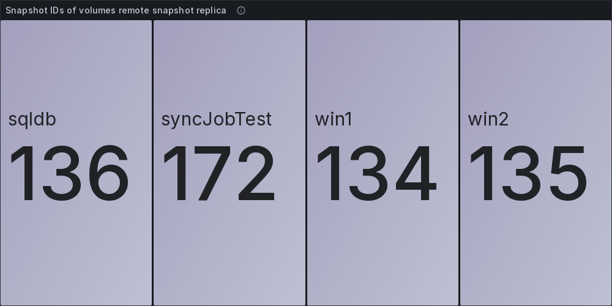

# Dashboards

- [Dashboards](#dashboards)
  - [Grafana version](#grafana-version)
    - [Grafana Data Source](#grafana-data-source)
    - [Aliasing or replacing Grafana's labels](#aliasing-or-replacing-grafanas-labels)
    - [Overcoming long updates of certain measurements](#overcoming-long-updates-of-certain-measurements)
    - [Add cluster or data source other variable to dashboard](#add-cluster-or-data-source-other-variable-to-dashboard)
  - [Measurements](#measurements)
    - [Experimental measurements](#experimental-measurements)
  - [Reference InfluxQL queries and dashboard examples SFC](#reference-influxql-queries-and-dashboard-examples-sfc)
    - [Notes](#notes)
    - [Account efficiency (`account_efficiency`)](#account-efficiency-account_efficiency)
    - [Accounts (`accounts`)](#accounts-accounts)
    - [Cluster capacity (`cluster_capacity`)](#cluster-capacity-cluster_capacity)
    - [Cluster faults (`cluster_faults`)](#cluster-faults-cluster_faults)
    - [Cluster performance (`cluster_performance`)](#cluster-performance-cluster_performance)
    - [Cluster version (`cluster_version`)](#cluster-version-cluster_version)
    - [Drive stats (`drive_stats`)](#drive-stats-drive_stats)
    - [Node performance (`node_performance`)](#node-performance-node_performance)
    - [iSCSI connections (`iscsi_sessions`)](#iscsi-connections-iscsi_sessions)
    - [Sync jobs (`sync_jobs`)](#sync-jobs-sync_jobs)
    - [Volume efficiency (`volume_efficiency`)](#volume-efficiency-volume_efficiency)
    - [Volumes (`volumes`)](#volumes-volumes)
    - [Volume performance (`volume_performance`)](#volume-performance-volume_performance)
    - [Data and queries for experimental measurements](#data-and-queries-for-experimental-measurements)
      - [QoS Histograms (`histogram_*`)](#qos-histograms-histogram_)
      - [Schedules (`schedules`)](#schedules-schedules)
      - [Snapshots (`snapshots`)](#snapshots-snapshots)
      - [Snapshot groups (`snapshot_groups`)](#snapshot-groups-snapshot_groups)
- [List of Influx tables in SFC](#list-of-influx-tables-in-sfc)
  - [Table: account\_efficiency](#table-account_efficiency)
  - [Table: accounts](#table-accounts)
  - [Table: cluster\_capacity](#table-cluster_capacity)
  - [Table: cluster\_faults](#table-cluster_faults)
  - [Table: cluster\_performance](#table-cluster_performance)
  - [Table: cluster\_version](#table-cluster_version)
  - [Table: drive\_stats](#table-drive_stats)
  - [Table: node\_performance](#table-node_performance)
  - [Table: volume\_efficiency](#table-volume_efficiency)
  - [Table: volume\_performance](#table-volume_performance)
  - [Table: volumes](#table-volumes)

## Grafana version

Grafana v12.0 was used in the development of SFC v2.1, but SFC has no dependencies or plugins that depend on Grafana 12 or its plugins.

If reference dashboard or queries don't work with latest release of Grafana, please import the dashboard and try different panel settings or queries. 

### Grafana Data Source

How to create an InfluxDB source in Grafana 12:

- Go to `Sources` > `Add data source`
- Pick `InfluxDB` and `InfluxQL` (unless you prefer `SQL` which I haven't tested)
- Give the new source a name such as `sfc` (for SolidFire Collector)
- `HTTP` > `URL`: if InfluxDB is running on same OS, `https://localhost:8181`, if in Kubernetes or Docker Compose you may use `https://influxdb:8181`, if elsewhere then maybe `https://FQDN` or `https://some.host.com.org:58086`, etc. You *may* fall back to HTTP, and disable TLS validation if using a "snake oil" TLS certificate, but then sfc.py also has to be changed to use HTTP.
- You must get API token and configure Headers
- Scroll all the way to the bottom, click `Save & Test`

Top of the page:


Bottom:


### Aliasing or replacing Grafana's labels

Certain parts of Grafana are hard to use.

Personally I find the difficulty of aliasing data in labels the worst. Below in Account Efficiency, there's an example on how to do that. The same general technique works for other metrics below. The Grafana Web site and Community have additional approaches and workarounds.

### Overcoming long updates of certain measurements

As explained elsewhere, SFC uses three schedules for high, medium and low-frequency of data collection. 

- First, the idea is that one is *unlikely* to have high- and low-frequency metrics in the same dashboard, but if they do, then they won't need to zoom to less than 15-60 minute windows
- Second, most users who do need to zoom to 1-15 minute segments will want to do that only for a subset of data and a best practice for this is to not have all panels zoomable to that level

You may consider this approach:

- One frequently-refreshing short-time interval dashboard with volumes, cluster faults, possibly mixed with some other metrics (network, hypervisor) from your environment
- Another dashboard for storage management - 1 hour to 30 day zoom level - to deal with QoS, storage utilization trends, etc.

Of course, nothing prevents you from having everything in one dashboard, but what happens is if you zoom to a 10 minute segment, many panels will have `No data` since SFC sends updates every 15-60 minutes. That's mostly okay since you're not interested in those panels anyway (you wouldn't be zooming if you were), but if you want to prevent that for general users, you can create a dashboard with some limitations

- Go to your SFC dashboard's Settings
- Scroll down to `Time options` > `Auto refresh` and enter a list of higher-duration values such as `30m,1h,2h,4h,8h,12h,1d,7d,28d`
- Just below, optionally enable `Hide time picker` 
- Save your "slow" dashboard using a pre-set time-range set to reasonable value:
  - Select reasonable time range (e.g. 2 days) for your users
  - Click on the little floppy disk icon to save your slow dashboard and select `Save current time range as dashboard default`

### Add cluster or data source other variable to dashboard

Users who have multiple clusters or data sources may [add variables to dashboard](https://grafana.com/docs/grafana/latest/dashboards/variables/add-template-variables/#add-a-query-variable).

That may also be useful for dealing with down-sampled data because down-sampled and default measurement names differ in InfluxDB v1.

The reference dashboard has a cluster name variable, which can be useful if multiple clusters report into the same InfluxDB. Select "All" to view all clusters, or any individual if you want to see just one. Panels may be adjusted to show a separate panel for each variable (i.e. two panels for two clusters) or all in one (repeat disabled, which is the default) - to see those go to: Panel Options > Repeat options.

## Measurements

This is what's collected by default. Volume properties and statistics are collected frequently (60s by default) while the rest may have medium or low frequency of collection. See the main README.md or the source code for more.

- account_efficiency
- accounts
- cluster_capacity
- cluster_faults
- cluster_performance
- cluster_version
- drive_stats
- iscsi_sessions
- node_performance
- volume_efficiency
- volume_performance
- volumes

### Experimental measurements

These are activated by passing `-ex` to SFC and you can see what they do and how at [the bottom of this page](#data-and-queries-for-experimental-measurements).

As you will notice later, not all measurements are conductive to easy visualization in Grafana. On the one hand that's because they are strings which may require more work, on the other the idea is they may be useful for reporting and querying outside of Grafana.

## Reference InfluxQL queries and dashboard examples SFC

### Notes

Some queries here and also in reference [dashboard.json](./dashboard.json) have an unnecessary `alias` or other setting in them. That doesn't mean it should be used or that I recommend it - it may be junk from my testing. 

Some queries are set to use `last`, others `mean`. In some cases `last` is used because that's what I wanted while working on SFC. For example, in cluster faults I don't want `mean` of 0s (no problem) and 1s (unresolved fault). Where `mean` is used it may be only because that's what Grafana does by default. In other cases maybe I have `last` simply because I wanted to see if the code was working properly, but normally I'd use `mean`. And finally, there may be cases where you'd want something different, so feel free to modify any and all queries to suit your needs.

Reference dashboard contains all queries mentioned below, so you don't need to copy-paste them into Grafana if you import my dashboard and set it to your source. If any of the queries below doesn't work (maybe I made typo while formatting, etc.), you can get it from dashboard.json since that file is dumped from Grafana without any changes.

**NOTE:** measurements ("tables") with low and medium collection frequency won't be created until those run for the first time and find something to report. It may take up to one hour for those measurements to appear in InfluxDB and become query-able in Grafana.

### Account efficiency (`account_efficiency`)

Storage efficiency is pre-created and we can get account-level storage efficiency (product of compression and deduplication for all volumes owned by a tenant) with this SQL query.

```sql
SELECT mean("storage_efficiency") FROM "account_efficiency" 
  WHERE $timeFilter GROUP BY time($__interval), "name"::tag
```

If you were you select two values - `compression` and `deduplication` - and use Stat, Grafana may show nonsense metric labels.

```sql
SELECT mean("compression"), mean("deduplication") 
  FROM "account_efficiency" 
  WHERE $timeFilter 
  GROUP BY time($__interval), "id"::tag fill(null)
```

- The above will make Stat show junk like `account_efficiency.mean { id: 1 }` above each metric
- What you *want* to see is `1` (i.e. just the account ID)
  - In SQL query area go to `Transform data` tab, add `Rename fields by regex` transformation and then
  - Match: `account_efficiency.mean { id: (.*) }` 
  - Replace with: `Account ID $1`


"Group by" can also use (account) name, in which case the above would still work, just use `{ name: (.*) }` instead of ID-based search in regex transformation.

```sql
SELECT mean("compression"), mean("deduplication") 
  FROM "account_efficiency" 
  WHERE $timeFilter 
  GROUP BY time($__interval), "name"::tag fill(null)
```


### Accounts (`accounts`)

```sql
SELECT mean("volume_count") FROM "accounts" 
  WHERE $timeFilter 
  GROUP BY time($__interval), "name"::tag fill(null)
```

These have just few basic properties of storage accounts (tenants). 

The above example shows volume count by tenant, which may be useful if you are in an environment where volume count or connection count is close to the SolidFire maximums. You may have 10 Kubernetes clusters, for example, where each instance of Trident uses a separate account and has 200-300 volumes.


If you want to produce a simple "table"-like list of your accounts, consider using Bar Gauge with this query:

```sql
SELECT last("volume_count") FROM "accounts" 
  WHERE $timeFilter 
  GROUP BY time($__interval), "name"::tag, "id"::tag fill(null) 
  LIMIT 1
```

`LIMIT 1` is the key that makes table show faster.

This screenshot is large, but in my dashboard the panel is very small. When I show (another panel with) accounts as IDs, I can look them up in a smaller panel on the side.


### Cluster capacity (`cluster_capacity`)

Almost all useful details from SolidFire's GetClusterCapacity are passed to InfluxDB.

```sql
SELECT mean("active_sessions") FROM "cluster_capacity" 
  WHERE $timeFilter 
  GROUP BY time($__interval) fill(null)
```


### Cluster faults (`cluster_faults`)

```sql
SELECT mean("warning") FROM "cluster_faults" 
  WHERE $timeFilter 
  GROUP BY time($__interval) fill(null)
```

You may create one panel that gets of those and groups them, or create several panels (one for each level).

```sql
# query A 
SELECT last("warning") AS "alias" FROM "cluster_faults" WHERE $timeFilter GROUP BY time($__interval)
# query B
SELECT last("error") FROM "cluster_faults" WHERE $timeFilter GROUP BY time($__interval)
# query C
SELECT last("critical") FROM "cluster_faults" WHERE $timeFilter GROUP BY time($__interval)
# query D
SELECT last("bestPractices") FROM "cluster_faults" WHERE $timeFilter GROUP BY time($__interval)
```

That should show something like this:


### Cluster performance (`cluster_performance`)

The SolidFire API method calls these "cluster stats". I call them cluster performance.

```sql
SELECT mean("normalized_iops") FROM "cluster_performance" 
  WHERE $timeFilter 
  GROUP BY time($__interval) fill(null)
```

There's a whole bunch of fields in here and the above shows just one of them `normalized_iops`. The names correspond to the keys from the SolidFire method.

As you can see here, there's nothing going on in my environment and I didn't even change legend, but you get the idea.


### Cluster version (`cluster_version`)

This is a simple one, just to keep an eye on the API and software version and also the cluster name (`PROD`, below). That's important for multi-cluster environments and/or if you collect data from multiple clusters into the same InfluxDB.

```sql
> select * from cluster_version
name: cluster_version
time                 api_version name version
----                 ----------- ---- -------
2024-05-26T10:27:06Z 12.5        PROD 12.5.0.897
```

This I don't visualize, as it's not necessary for people with one cluster (not to mention SolidFire has been end-of-sale'd so it's not like anyone will fall behind when it comes to software updates). The purpose of collecting this measurement is to get the cluster name (`PROD` in my case) which is inserted into other measurements. 

People who have a bunch of clusters and are slow to update may want to gather these, but by now I assume everyone is on latest version because updates are rare.


### Drive stats (`drive_stats`)

I develop SFC on SolidFire Demo VM so I can't produce meaningful drive statistics, but here's what's collected:

```sql
> select * from drive_stats
time                 activeSessions cluster drive_id iosInProgress lifeRemainingPercent powerOnHours
----                 -------------- ------- -------- ------------- -------------------- ------------
2024-05-26T10:27:06Z 3              PROD    1        0             0                    0
2024-05-26T10:27:06Z                PROD    4        0             0                    0
2024-05-26T10:27:06Z                PROD    3        0             0                    0
2024-05-26T10:27:06Z                PROD    2        0             0                    0

```

Active session metric exists on metadata disks, while the other three metrics included apply to all.

One can't get meaningful lifeRemainingPercent and powerOnHours in a VM so I won't share a screenshots. In physical environments these may be useful for long-term maintenance.

Note that lifeRemainingPercent really means (100-lifeRemainingPercent), i.e. it means the opposite from what it says. 15 means 85% remains. I didn't want to transform this value to (100-lifeRemainingPercent) in order to avoid confusion - the figure here is the same (misleading) number that you get from the SolidFire API.


### Node performance (`node_performance`)

You may find these in the API as "node stats".

```sql
SELECT mean("cpu") FROM "node_performance" 
  WHERE $timeFilter 
  GROUP BY time($__interval) fill(null)
```

I guess nodes' stats may be mildly useful if suspecting major imbalance in volumes. The example above shows `cpu` value.


Most of the stuff in the API response isn't useful so in addition to CPU, only two other metrics are collected:
- networkUtilizationCluster
- networkUtilizationStorage

File an issue if you need more and I'll see what I can do. Or submit a pull request.


### iSCSI connections (`iscsi_sessions`)

```sql
SELECT mean("ms_since_last_scsi_command") FROM "iscsi_sessions" 
  WHERE $timeFilter 
  GROUP BY time($__interval) fill(null)
```

This example shows milliseconds since last client's SCSI command, which Windows clients send approximately every 45s-50s. This can be used to find dead clients and unused disks.


There are 2-3 other metrics such as session instance and service ID (could be MD service on SolidFire). Generally these aren't that actionable but may be used to visualize client connectivity across cluster nodes.

If there are no iSCSI connections, the table aka "measurement" will not be created until iSCSI connections appear and get recorded in the next medium-frequency run.

### Sync jobs (`sync_jobs`)

This one is "special". 

First, SFC currently parses only one type of SolidFire sync job, remote sync used for initial replication (and re-sync).

Second, in my observation you can view these only on the cluster where replication is *in*-bound. If you have replication flowing in one direction, I think you can get these details only at the destination.

Below `cluster::tag = 'DR'` is for that. Use the right name of the cluster that is a destination (of volume replication).

```sql
SELECT last("remaining_time") FROM "sync_jobs"
  WHERE ("cluster"::tag = 'DR') AND $timeFilter 
  GROUP BY time($interval), "dst_volume_id"::tag 
  ORDER BY time DESC
```

Third, if network is fast or volumes small, you may rarely see these jobs even though they're gathered every 60 seconds. For example, I paused and resumed replication half a dozen times here and only once did I see it in Grafana.


Fourth, notice that remaining time may be 0, so Grafana won't show anything (well, showing 0s in this panel may help as long as NaN isn't shown as 0). In any case, this is normal - SolidFire may be comparing changes but not yet copying, so there's no way to give a meaningful time remaining, while the next time SFC checks, the job is done and gone.

```sql
> select * from sync_jobs
name: sync_jobs
time                 blocks_per_sec cluster dst_volume_id elapsed_time pct_complete remaining_time    stage type
----                 -------------- ------- ------------- ------------ ------------ --------------    ----- ----
2024-06-15T14:48:40Z 101968         DR      11            1            31           2.225806451612903 data  remote
2024-06-15T15:13:44Z 20404          DR      10            87           0            0                 data  remote
2024-06-15T15:14:44Z 20404          DR      10            87           0            0                 data  remote
2024-06-15T15:22:44Z 60269          DR      11            6            0            0                 data  remote
```

Fifth, the example above is for "time remaining". You may select other fields which may be more useful to you. `blocks_per_sec` use 4 KiB units and I don't believe that 512e impacts this metric.

### Volume efficiency (`volume_efficiency`)

Here I simply select all three efficiency-related properties and visualize them using Stat.

```sql
SELECT mean("compression"), mean("deduplication") 
  FROM "volume_efficiency" 
  WHERE $timeFilter 
  GROUP BY time($__interval), "id"::tag fill(null)
```

Volume compression multiplied by volume deduplication give us what's commonly known as "storage efficiency factor". (Most people don't consider Thin Provisioning to be part of this). 

While that can be done in Grafana, this metric is generated by SFC and while not present in the API it is available in this measurement, so if you want to get that without fiddling with Grafana you can query it.

```sql
SELECT mean("storage_efficiency") 
  FROM "volume_efficiency" 
  WHERE $timeFilter 
  GROUP BY time($__interval), "id"::tag fill(null)
```


### Volumes (`volumes`)

These container volume properties including volume names. Other metrics may have volume names in them because SFC gets the names this way and inserts them into other measurements.

Here's a less common example - a query for a Stat visualization for QoS policy IDs:

```sql
SELECT mean("qos_policy_id") FROM "volumes" 
  WHERE $timeFilter 
  GROUP BY time($__interval), "name"::tag fill(null)
```

This can be useful if you want to enforce the use of QoS Policy IDs - which is preferable over "custom" settings for each volume, and generally seeing how many volumes use which QoS Policy. It also shows those that don't have it set (`0`), which may be common in containerized environments.


Another use case is in multi-cluster scenarios where you may want to apply settings to a volume replica.

Basic volume pairing information is collected as well. By basic I mean that only the first pairing is analyzed, and not all details are included to avoid problems with parsing and typing. Most users don't have more than one pairing per volume and three clusters would be required to try and test, so the number of monitored relationships (which is one) per volume is unlikely to grow.

Field/tag assignment may change if necessary, but at least initially this is one example of how to use it.

```sql
SELECT last("remote_replication_mode") FROM "volumes" 
  WHERE $timeFilter 
  GROUP BY time($__interval), "name"::tag fill(null)
```


You can try different visualizations, of course. This one shows 6 volumes, although only 3 are being replicated. How's that possible? Well, I started monitoring both sides (two clusters) to view sync job progress, and suddenly I saw six volumes. My query above is not limited to any specific cluster name (tag), so as soon as two sites started sending in data, the panel changed from showing three volumes to showing six. Of course, you can adjust this to filter by site or show each site in a different panel, etc.


Replication monitoring is new in SFC v2 and based on feedback the details may be changed. Currently it is limited to the just two clusters, i.e. only the first replication relationship for a volume is captured, parsed and stored. If a volume has more than one pair, SFC will ignore the rest.

If you're interested in these details, see [this](https://scaleoutsean.github.io/2024/06/15/sfc-adds-volume-replication-monitoring.html) for more on the initial implementation and [this](https://scaleoutsean.github.io/2024/06/14/netapp-solidfire-replication-monitoring.html) for API-related background and various considerations. The SolidFire API returns descriptive strings, and SFC stores numbers. For example: Async gets stored as 1, Sync as 2, SnapshotsOnly as 3, in InfluxDB. For replication states, there's a bunch of them, and the up-to-date mapping can be found in the SFC source code. Where 0 values could be confusing as numeric proxies for `null` or `None`, I use `-1`. So if you see `-1` somewhere related to replication, that's usually "not configured" i.e. the volume isn't even paired. Then you can filter out such values (lower than 0) in queries and/or Grafana.

For the monitoring of initial replication sync ("baseline copy") we need to [use `ListSyncJobs`](https://scaleoutsean.github.io/2024/06/14/netapp-solidfire-replication-monitoring.html) which is available in [Sync jobs](#sync-jobs-sync_jobs).

SFC also collects volume attributes set by Trident CSI. Note that other attributes (those that may be set by non-Trident CSI) are ignored, mostly because I haven't yet thought about how to handle them and estimate their impact on InfluxDB.

The following InfluxQL query shows recent volume ID, size and name of PVCs created by Trident v24.06.0.

```sql
> SELECT id,total_size,va_docker_name,va_fstype,va_trident_version,va_trident_backend_uuid FROM volumes WHERE va_trident_version='24.06.0' AND time > (now()-10m)
name: volumes
time                 id  total_size va_docker_name                           va_fstype va_trident_version va_trident_backend_uuid
----                 --  ---------- --------------                           --------- ------------------ -----------------------
2024-07-03T07:51:35Z 176 2147483648 pvc-2435957e-cb7d-42fd-9f2e-d0c52700db7e xfs       24.06.0            8957837e-6a62-4f19-b158-2bb7cd143d93
2024-07-03T07:51:35Z 178 2147483648 pvc-cea17a61-0017-4bd5-9623-0b2303d89630 raw       24.06.0            8957837e-6a62-4f19-b158-2bb7cd143d93
```

These values are all strings, so I'm not sure how they can be made useful in Grafana dashboards. 

While they can be visualized in log-style Grafana panels, that doesn't seem particularly useful and for now the reference dashboard does not include any examples. If anyone has an idea of how to improve the format or field/tag assignment without bloating the measurement in terms of series cardinality and such, suggestions are welcome (use Issues).

Volume attributes are expected to be useful in lookup and reporting of Trident CSI-provisioned volumes, including in the situations where Trident volumes are replicated to another cluster. Neither Trident CSI nor SolidFire provide a way to query volume attributes or create reports based on volume attributes, and the volumes measurement makes that possible for both single cluster and volumes replicated across different clusters.

### Volume performance (`volume_performance`)

Volume performance metrics are what you'd expect. The API calls them volume stats.

```sql
SELECT mean("actual_iops") FROM "volume_performance" 
  WHERE ("name"::tag = 'data') AND $timeFilter 
  GROUP BY time($__interval), "name"::tag fill(null)
```

This is like in the SolidFire API response, but with volume names added. Personally I prefer to pick a handful volumes - for which I usually know the ID - and just watch these few in a panel named after my important application.

```sql
SELECT mean("average_io_size"), mean("actual_iops") 
  FROM "volume_performance" 
  WHERE ("id"::tag = '134') AND $timeFilter 
  GROUP BY time($__interval), "name"::tag fill(null)
```

This example shows stats for volume ID 134 (mostly idle, except for when I started the VM and SQL Server came to life).


Query I use in a Bar Gauge visualization:

```sql
SELECT mean("burst_io_credit") FROM "volume_performance" 
  WHERE $timeFilter 
  GROUP BY time($__interval), "name"::tag fill(null)
```

It shows how much burst credit each volume has.


If burst credit is needed by some critical application, it may be wise to tighten MaxIOPS on volumes which don't need a lot of burst credits. That way when a volume does burst, it eliminates the risk of having some random app also burst and take away from what's actually available in terms of burst-able IOPS on the node.

Finally, remember that burst credits on a volume are accumulated when iSCSI client doesn't consume Max IOPS. That is, consuming 900 IOPS on a volume with the QoS set to (50,1000,2000) means in 90 seconds the client will accumulate 90 x (1000-900) = 9,000 Burst IOPS (in 4 KiB requests). 

If a Web server rotates logs when they reach 100 MiB and compresses those by writing them out in 1 MiB requests, 9,000 in 4 KiB may [translate](https://docs.netapp.com/us-en/element-software/concepts/concept_data_manage_volumes_solidfire_quality_of_service.html#qos-performance) to a fraction of that value (let's say 2%, which is 180, enough for 180 x 1MiB requests) which in turn means this burst budget is enough to read a 100 MiB log file (access.log.1) and gzip it to disk as a 35 MB access.log.gz without getting throttled. You can also find appropriate values experimentally by looking at volume utilization percentage or one of the QoS histograms.

Huge burst credit on a volume may mean the volume MaxIOPS setting is too generous. Sometimes that's the idea, but other times that may be wasteful. If there's no problem, there's no need to worry about this, but when it is a problem being able to see this can be helpful.

Volume async replication delay is a property in volume performance measurement. It exists *only* for volumes that are in async replication mode and it's shown only for the source, not the target, volume.

```sql
SELECT last("async_delay") FROM "volume_performance" 
  WHERE ("async_delay"::field > -1) AND $timeFilter 
  GROUP BY time($interval), "name"::tag
```

Stat panels work well for this, but we can also watch async delay over time. 

Where 0 is used (e.g. async delay) is 0 seconds. To avoid confusion with volumes that aren't even a source of replication, all non-replicating volumes get `-1` here, so just eliminate such volumes from panels when working in Grafana.


Note that replicated snapshots, which are asynchronously replicated as well, are their own "feature" and you can't see snapshot replication delay in volume performance metrics. See [Snapshots](#snapshots-snapshots).


### Data and queries for experimental measurements

While the details of all measurements are subject to change, these are more likely to be changed in terms of what's collected, what gets stored, and what's a tag vs. a field.

#### QoS Histograms (`histogram_*`)

QoS histograms are *not* collected by default. You may enable QoS histogram collection with a switch (`sfc.py -h`). 

- histogram_below_min_iops_percentages
- histogram_min_to_max_iops_percentages
- histogram_read_block_sizes
- histogram_target_utilization_percentage
- histogram_throttle_percentages
- histogram_write_block_sizes

These metrics correspond to the names from the SolidFire API, so you can refer to the SolidFire documentation. 

SFC changes names of histogram buckets to be Grafana-friendly, but it's easy to tell which SFC bucket name corresponds to the original bucket name from the original histogram object.

I've tried hard to find a way to use this information, and haven't been successful so far. Histograms are by default disabled as I'm not certain of their usefulness, but you may enable them from the CLI (`-h`) and try to figure them out (histogram_below_min_iops_percentages and histogram_min_to_max_iops_percentages).

Write block sizes visualized using Time Series:

```sql
SELECT "b_000512_to_004095", "b_004096_to_008191", "b_008192_to_016383", "b_016384_to_032767", "b_032768_to_65535", "b_065536_to_131071", "b_131072_plus" 
  FROM "histogram_write_block_sizes" 
  WHERE ("id"::tag = '134') AND $timeFilter 
  GROUP BY "id"::tag
```


You can't see much unless you hover over the graph and then you'd see data points broken down by request size (0.5 to 4 KiB, 4-8 KiB, etc.). But you can see that one band or bucket (shown in yellow) occupies almost 50% of all IO. That's 4-8 KiB requests, and this client is (an idle) MS SQL Server 2022.

This example is for Heatmap from the same QoS histogram.

```sql
SELECT last("b_01_to_19") 
  AS "alias", last("b_20_to_39") 
  AS "alias", last("b_40_to_59") 
  AS "alias", last("b_60_to_79") 
  AS "alias", last("b_80_to_100") 
  AS "alias" FROM "histogram_below_min_iops_percentages" 
  WHERE ("id"::tag = '134') AND $timeFilter 
  GROUP BY time($__interval)
```

This is why I consider QoS Histograms experimental - until I understand what this below means, I see no point in collecting that data and wasting disk space. Deep-colored vertical orange bars mean most counts were low percentage numbers. But does that mean that most time was spent between Min and Max (histogram_min_to_max_iops_percentages) or that within time spent below Min IOPS, most of it was 01-19% of Min IOPS? I don't know.


#### Schedules (`schedules`)

This "table" extracts a subset of information from `ListSchedules` responses.

In InfluxDB initial implementation collects the following.

Tags:

- cluster
- schedule_id
- schedule_type

Fields:

- enable_remote_replication
- enable_serial_creation
- has_error
- last_run_status
- paused
- recurring
- run_next_interval
- schedule_name
- snapshot_name

My guess is schedules don't change often, so the cost of having this information is low. It may not be very useful, but at least it allows users to view the details of their data protection without asking the administrator.

#### Snapshots (`snapshots`)

The main problem with snapshots is this: imagine a small cluster with 4 nodes and 400 volumes per node, each with 32 snapshots. That's up to 51,200 entries per each collection run. 

Then there are other problems (such as which of the many details to keep and how, etc.).

I've tried many ways but couldn't easily create anything useful with these, no matter how I rearranged tags and fields. The initial implementation:

Fields:

- group_id          integer
- new_snapshot_name string
- volume_id         integer

Tags:

- cluster
- enable_remote_replication
- remote_status
- snapshot_id
- status
- volume_name
- volume_pair_uuid

The problem with these - no matter how you arrange them (I've tried half a dozen ways) - is snapshot IDs change often as old snapshots expire and new get created, so no one is supposed to remember those.

In Grafana, if you select the `snapshot_id` field, these change all the time, so viewing that now snapshot_id 759 is there whereas 2 days ago it was 740 doesn't really help. If we choose volume IDs instead, that's also useless, only in reverse (now you see volume ID 134 has snapshot ID 759 and two days ago it was 740).

There are plenty of dates in the API response (create, expiration time) but I hesitate to collect those not knowing if there's a use case for that. It could be a lot of data (each volume may have 32 snapshots so with 1,00 volumes there may be 32,000 lines for each run), so I don't collect any of those dates until there's a use case for each additional tag or field.

I haven't tried that, but it may be interesting to visualize `snapshot_id` growth differential (vs 24 hours ago) by volume ID. So if today you see that the number is 24 for volume ID 134 (i.e. 24 new snapshots have been replicated) and 0 for volume ID 135, you know those have failed to replicate or someone has paused or disabled that in snapshot schedule. 

Data point examples: the Velero volume is a local snapshot (remote replication not enabled, *and* remote status is 0, so not replicated either). Group ID is 0, so that one isn't a part of a group. The second volume is part of `group-sql-snapshot`, is enabled for remote replication and there's a copy at the remote site (as expected, `volume_pair_uuid` shows this volume is paired, which is required in replication). (Both snapshots are of the same volume (sqldb), which is confusing but I was experimenting with Velero when I took it.)

```sql
> select * from snapshots
name: snapshots
time                 cluster enable_remote_replication group_id new_snapshot_name             remote_status snapshot_id status volume_id volume_name volume_pair_uuid
----                 ------- ------------------------- -------- -----------------             ------------- ----------- ------ --------- ----------- ----------------
2024-06-17T18:57:52Z PROD    0                         0        velero-vol-136-202404090609Z  0             438         1      136       sqldb       0
2024-06-17T18:57:52Z PROD    1                         116      group-sql-snapshot            1             799         1      136       sqldb       fba6dc63-993c-4a62-b85b-cb4043f04aae

```

The best I could do in Grafana:

```sql
SELECT distinct("volume_id") FROM "snapshots" 
  WHERE ("enable_remote_replication"::tag = '1' 
  AND "remote_status"::tag = '1') 
  AND $timeFilter 
  GROUP BY time($__interval), "volume_name"::tag
```



Volume properties show delay of async replication and whether snapshot has been replicated to the remote site, so if you want to monitor the progress or state, look at Volumes.

#### Snapshot groups (`snapshot_groups`)

Snapshot groups contain a digested subset of the API response because a lot of information in it isn't very suitable for visualization and bloats the database.

This InfluxDB query shows create time (since epoch), that remote replication is enabled (possible when the underlying volume is paired), expiration (90K seconds from create_time), the number of volumes in the group (here 3) and numeric code that the API returns as strings:

- `remote_grp_status` - 1 = Present (successfully replicated), other values = not present
- `status` - 1 = Done (created), other values = not present

```sql
> select * from snapshot_groups
name: snapshot_groups
time                 cluster create_time enable_remote_replication expiration_time grp_snapshot_id grp_snapshot_id_1 grp_snapshot_name  members remote_grp_status status
----                 ------- ----------- ------------------------- --------------- --------------- ----------------- -----------------  ------- ----------------- ------
2024-07-04T09:36:34Z PROD    1720022400  1                         90000           133             133               group-sql-snapshot 3       1                 1
2024-07-04T09:46:34Z PROD    1720022400  1                         90000           133             133               group-sql-snapshot 3       1                 1
2024-07-04T10:02:53Z PROD    1720022400  1                         90000           133             133               group-sql-snapshot 3       1                 1
```

# List of Influx tables in SFC

- Quite a few camel-cased keys that should be changed, but this is how it is now.
- Some tables may not be shown here due to certain features not being used (e.g. replication, (snapshot) schedules). You may find them in sfc.py or list the tables by yourself if they get populated by your SFC instance that uses them.

## Table: account_efficiency


Query: SHOW FIELD KEYS FROM account_efficiency

```raw
+--------------------+--------------------+-----------+
| iox::measurement   | fieldKey           | fieldType |
+--------------------+--------------------+-----------+
| account_efficiency | compression        | float     |
| account_efficiency | deduplication      | float     |
| account_efficiency | storage_efficiency | float     |
| account_efficiency | thin_provisioning  | float     |
+--------------------+--------------------+-----------+

```

Query: SHOW TAG KEYS FROM account_efficiency

```raw
+--------------------+---------+
| iox::measurement   | tagKey  |
+--------------------+---------+
| account_efficiency | cluster |
| account_efficiency | id      |
| account_efficiency | name    |
+--------------------+---------+

```
## Table: accounts


Query: SHOW FIELD KEYS FROM accounts

```raw
+------------------+--------------+-----------+
| iox::measurement | fieldKey     | fieldType |
+------------------+--------------+-----------+
| accounts         | active       | integer   |
| accounts         | volume_count | integer   |
+------------------+--------------+-----------+

```

Query: SHOW TAG KEYS FROM accounts

```raw
+------------------+---------+
| iox::measurement | tagKey  |
+------------------+---------+
| accounts         | cluster |
| accounts         | id      |
| accounts         | name    |
+------------------+---------+

```
## Table: cluster_capacity


Query: SHOW FIELD KEYS FROM cluster_capacity

```raw
+------------------+----------------------------------+-----------+
| iox::measurement | fieldKey                         | fieldType |
+------------------+----------------------------------+-----------+
| cluster_capacity | active_block_space               | integer   |
| cluster_capacity | active_sessions                  | integer   |
| cluster_capacity | average_iops                     | integer   |
| cluster_capacity | cluster_recent_io_size           | integer   |
| cluster_capacity | compressioN_factor               | float     |
| cluster_capacity | current_iops                     | integer   |
| cluster_capacity | dedupe_factor                    | float     |
| cluster_capacity | max_iops                         | integer   |
| cluster_capacity | max_overprovisionable_space      | integer   |
| cluster_capacity | max_provisioned_space            | integer   |
| cluster_capacity | max_used_metadata_space          | integer   |
| cluster_capacity | max_used_space                   | integer   |
| cluster_capacity | non_zero_blocks                  | integer   |
| cluster_capacity | peak_active_sessions             | integer   |
| cluster_capacity | peak_iops                        | integer   |
| cluster_capacity | provisioned_space                | integer   |
| cluster_capacity | snapshot_non_zero_blocks         | integer   |
| cluster_capacity | storage_efficiency               | float     |
| cluster_capacity | thin_factor                      | float     |
| cluster_capacity | total_ops                        | integer   |
| cluster_capacity | unique_block_space               | integer   |
| cluster_capacity | unique_blocks                    | integer   |
| cluster_capacity | used_block_space                 | integer   |
| cluster_capacity | used_metadata_space_in_snapshots | integer   |
| cluster_capacity | used_space                       | integer   |
| cluster_capacity | zero_blocks                      | integer   |
+------------------+----------------------------------+-----------+

```

Query: SHOW TAG KEYS FROM cluster_capacity

```raw
+------------------+--------+
| iox::measurement | tagKey |
+------------------+--------+
| cluster_capacity | name   |
+------------------+--------+

```
## Table: cluster_faults


Query: SHOW FIELD KEYS FROM cluster_faults

```raw
+------------------+---------------+-----------+
| iox::measurement | fieldKey      | fieldType |
+------------------+---------------+-----------+
| cluster_faults   | bestPractices | integer   |
| cluster_faults   | critical      | integer   |
| cluster_faults   | error         | integer   |
| cluster_faults   | warning       | integer   |
+------------------+---------------+-----------+

```

Query: SHOW TAG KEYS FROM cluster_faults

```raw
+------------------+---------+
| iox::measurement | tagKey  |
+------------------+---------+
| cluster_faults   | cluster |
| cluster_faults   | total   |
+------------------+---------+

```
## Table: cluster_performance


Query: SHOW FIELD KEYS FROM cluster_performance

```raw
+---------------------+-------------------------+-----------+
| iox::measurement    | fieldKey                | fieldType |
+---------------------+-------------------------+-----------+
| cluster_performance | actual_iops             | integer   |
| cluster_performance | average_iops            | integer   |
| cluster_performance | client_queue_depth      | integer   |
| cluster_performance | cluster_utilization     | float     |
| cluster_performance | latency_usec            | integer   |
| cluster_performance | normalized_iops         | integer   |
| cluster_performance | read_bytes_last_sample  | integer   |
| cluster_performance | read_latency_usec       | integer   |
| cluster_performance | read_ops_last_sample    | integer   |
| cluster_performance | write_bytes_last_sample | integer   |
| cluster_performance | write_latency_usec      | integer   |
| cluster_performance | write_ops_last_sample   | integer   |
+---------------------+-------------------------+-----------+

```

Query: SHOW TAG KEYS FROM cluster_performance

```raw
+---------------------+--------+
| iox::measurement    | tagKey |
+---------------------+--------+
| cluster_performance | name   |
+---------------------+--------+

```
## Table: cluster_version


Query: SHOW FIELD KEYS FROM cluster_version

```raw
+------------------+-------------+-----------+
| iox::measurement | fieldKey    | fieldType |
+------------------+-------------+-----------+
| cluster_version  | api_version | float     |
+------------------+-------------+-----------+

```

Query: SHOW TAG KEYS FROM cluster_version

```raw
+------------------+---------+
| iox::measurement | tagKey  |
+------------------+---------+
| cluster_version  | name    |
| cluster_version  | version |
+------------------+---------+

```
## Table: drive_stats


Query: SHOW FIELD KEYS FROM drive_stats

```raw
+------------------+----------------------+-----------+
| iox::measurement | fieldKey             | fieldType |
+------------------+----------------------+-----------+
| drive_stats      | activeSessions       | integer   |
| drive_stats      | iosInProgress        | integer   |
| drive_stats      | lifeRemainingPercent | integer   |
| drive_stats      | powerOnHours         | integer   |
+------------------+----------------------+-----------+

```

Query: SHOW TAG KEYS FROM iscsi_sessions

```raw
+------------------+----------------------+
| iox::measurement | tagKey               |
+------------------+----------------------+
| iscsi_sessions   | account_id           |
| iscsi_sessions   | account_name         |
| iscsi_sessions   | auth_method          |
| iscsi_sessions   | chap_algorithm       |
| iscsi_sessions   | chap_username        |
| iscsi_sessions   | cluster              |
| iscsi_sessions   | initiator_alias      |
| iscsi_sessions   | initiator_id         |
| iscsi_sessions   | initiator_ip         |
| iscsi_sessions   | initiator_name       |
| iscsi_sessions   | initiator_session_id |
| iscsi_sessions   | node_id              |
| iscsi_sessions   | target_ip            |
| iscsi_sessions   | target_name          |
| iscsi_sessions   | virtual_network_id   |
| iscsi_sessions   | volume_id            |
+------------------+----------------------+

```


Query: SHOW TAG KEYS FROM drive_stats

```raw
+------------------+---------+
| iox::measurement | tagKey  |
+------------------+---------+
| drive_stats      | cluster |
| drive_stats      | id      |
+------------------+---------+

```
## Table: node_performance


Query: SHOW FIELD KEYS FROM node_performance

```raw
+------------------+-----------------------------+-----------+
| iox::measurement | fieldKey                    | fieldType |
+------------------+-----------------------------+-----------+
| node_performance | cpu                         | integer   |
| node_performance | network_utilization_cluster | integer   |
| node_performance | network_utilization_storage | integer   |
+------------------+-----------------------------+-----------+

```

Query: SHOW TAG KEYS FROM node_performance

```raw
+------------------+---------+
| iox::measurement | tagKey  |
+------------------+---------+
| node_performance | cluster |
| node_performance | id      |
+------------------+---------+

```
## Table: volume_efficiency


Query: SHOW FIELD KEYS FROM volume_efficiency

```raw
+-------------------+--------------------+-----------+
| iox::measurement  | fieldKey           | fieldType |
+-------------------+--------------------+-----------+
| volume_efficiency | compression        | float     |
| volume_efficiency | deduplication      | float     |
| volume_efficiency | storage_efficiency | float     |
| volume_efficiency | thin_provisioning  | float     |
+-------------------+--------------------+-----------+

```

Query: SHOW TAG KEYS FROM volume_efficiency

```raw
+-------------------+---------+
| iox::measurement  | tagKey  |
+-------------------+---------+
| volume_efficiency | cluster |
| volume_efficiency | id      |
| volume_efficiency | name    |
+-------------------+---------+

```
## Table: volume_performance


Query: SHOW FIELD KEYS FROM volume_performance

```raw
+--------------------+-------------------------+-----------+
| iox::measurement   | fieldKey                | fieldType |
+--------------------+-------------------------+-----------+
| volume_performance | actual_iops             | integer   |
| volume_performance | async_delay             | integer   |
| volume_performance | average_io_size         | integer   |
| volume_performance | burst_io_credit         | integer   |
| volume_performance | client_queue_depth      | integer   |
| volume_performance | latency_usec            | integer   |
| volume_performance | non_zero_blocks         | integer   |
| volume_performance | normalized_iops         | integer   |
| volume_performance | read_bytes              | integer   |
| volume_performance | read_bytes_last_sample  | integer   |
| volume_performance | read_latency_usec       | integer   |
| volume_performance | read_ops_last_sample    | integer   |
| volume_performance | throttle                | float     |
| volume_performance | volume_size             | integer   |
| volume_performance | volume_utilization      | float     |
| volume_performance | write_bytes             | integer   |
| volume_performance | write_bytes_last_sample | integer   |
| volume_performance | write_latency_usec      | integer   |
| volume_performance | write_ops_last_sample   | integer   |
| volume_performance | zero_blocks             | integer   |
+--------------------+-------------------------+-----------+

```

Query: SHOW TAG KEYS FROM volume_performance

```raw
+--------------------+---------+
| iox::measurement   | tagKey  |
+--------------------+---------+
| volume_performance | cluster |
| volume_performance | id      |
| volume_performance | name    |
+--------------------+---------+

```
## Table: volumes


Query: SHOW FIELD KEYS FROM volumes

```raw
+------------------+-------------------------------+-----------+
| iox::measurement | fieldKey                      | fieldType |
+------------------+-------------------------------+-----------+
| volumes          | block_size                    | integer   |
| volumes          | fifo_size                     | integer   |
| volumes          | min_fifo_size                 | integer   |
| volumes          | qos_policy_id                 | integer   |
| volumes          | remote_replication_mode       | integer   |
| volumes          | remote_replication_snap_state | integer   |
| volumes          | remote_replication_state      | integer   |
| volumes          | total_size                    | integer   |
| volumes          | va_docker_name                | string    |
| volumes          | va_fstype                     | string    |
| volumes          | va_provisioning               | string    |
| volumes          | va_trident_backend_uuid       | string    |
| volumes          | va_trident_platform           | string    |
| volumes          | va_trident_platform_version   | string    |
| volumes          | va_trident_plugin             | string    |
| volumes          | va_trident_version            | string    |
+------------------+-------------------------------+-----------+

```

Query: SHOW TAG KEYS FROM volumes

```raw
+------------------+--------------------+
| iox::measurement | tagKey             |
+------------------+--------------------+
| volumes          | access             |
| volumes          | account_id         |
| volumes          | cluster            |
| volumes          | cluster_pair_id    |
| volumes          | enable_512e        |
| volumes          | id                 |
| volumes          | name               |
| volumes          | remote_volume_id   |
| volumes          | remote_volume_name |
| volumes          | scsi_naa_dev_id    |
| volumes          | vol_cg_group_id    |
| volumes          | volume_pair_uuid   |
+------------------+--------------------+

```

